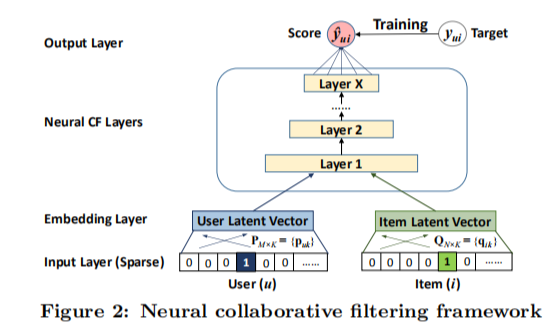

# When Federated Recommendation Meets Cold-Start Problem: Separating Item Attributes and User Interactions

摘要: 联邦冷启动
文献类型: WWW-2024

## 论文精读：

- NCF：
    
    
    

- IFedNCF（应用文中架构，以NCF为例）:
    
    
    
    IFedNCF由5个.py文件组成（data.py; engine.py; mlp.py; train.py; utils.py）
    
    - 代码中，对于服务器的学习率设置为0.005，而对于用户端的学习率设置为0.5
        
        根据论文，是通过在验证集上进行网格搜索调优得到
        
        分析：
        
        - **服务器端**：服务器端的学习率通常设置得较低，因为服务器端模型的更新是基于多个客户端上传的模型更新的聚合结果。
        - **用户端**：用户端的学习率可以设置得较高，因为每个客户端只基于自己的局部数据进行模型训练。较高的学习率可以帮助客户端模型快速适应本地数据的特性，尤其是在数据量较小的情况下。
    - 代码定义的 `load_data()` 方法（utils.py），将数据包装为数据字典。其中，对于数据的item_id作了一个映射，将所有的用户端的数据的item_id映射到一个连续的区间：
        
        ```python
         train_item_ids_map = {iid: i for i, iid in enumerate(train_item_ids)}
            for i in train_item_ids_map.keys():
                train['iid'].replace(i, train_item_ids_map[i], inplace=True)
         # 对于test和vali的item_ids_map作同样的处理
        ```
        
        分析可能作用：将所有客户端的item_id映射到一个连续整数区间。这样，即使原始ID不连续，它们在全局模型中也有一个唯一的、连续的表示。这种映射确保了模型在不同客户端间传输和更新时，物品特征的对应关系保持一致，从而维护了数据的一致性与模型的可解释性。
        
    - IFedNCF的网络结构(MLP.py)：
        
        用户端User_embedding,Item_embedding,Rating_Prediction三个模块的具体实现：
        
        ```python
        class Client(torch.nn.Module):
            def __init__(self, config):
                super(Client, self).__init__()
                self.config = config
                self.num_items_train = config['num_items_train']
                self.latent_dim = config['latent_dim']
        
                self.embedding_user = torch.nn.Embedding(num_embeddings=1, embedding_dim=self.latent_dim)
                # user_embedding模块，个数为1，嵌入维度等于item特征表示维度
                self.embedding_item = torch.nn.Embedding(num_embeddings=self.num_items_train, embedding_dim=self.latent_dim)
                # item_embedding模块，个数为训练集的item数，嵌入维度等于item特征表示维度
        
                self.fc_layers = torch.nn.ModuleList() # torch.nn.ModuleList 是 PyTorch 中的一个容器类，用于存储多个 torch.nn.Module 对象
                # 评分预测模块
                """
                结合forward()方法,若按照默设置
                parser.add_argument('--client_model_layers', type=str, default='400, 200'),
                评分模块为一个输入维度为400,输出维度为200的线性层.
                后接一个输入维度为200,输出维度为1的线性层.最后接一个sigmoid()函数
                将输出转化为概率.
                """
                for idx, (in_size, out_size) in enumerate(zip(config['client_model_layers'][:-1], config['client_model_layers'][1:])):
                    self.fc_layers.append(torch.nn.Linear(in_size, out_size))
                
                self.affine_output = torch.nn.Linear(in_features=config['client_model_layers'][-1], out_features=1)
                self.logistic = torch.nn.Sigmoid()
        ```
        
        在前向传播时，由于采用联邦学习，每个客户端的user_embedding置0，user_embedding和item_embedding通过简单的连接操作输入全连接层。`code_prediction()`方法用于冷启动预测，运算过程与`forward()`方法相同。
        
        对于服务器，其**Meta Attributr Network:**
        
        ```python
        for idx, (in_size, out_size) in enumerate(zip(config['server_model_layers'][:-1], config['server_model_layers'][1:])):
                    self.fc_layers.append(torch.nn.Linear(in_size, out_size))
                # 若按照默认设置sever_model_layers='300',则此处fc_layers为空
                self.affine_output = torch.nn.Linear(in_features=config['server_model_layers'][-1], out_features=self.latent_dim)
                self.logistic = torch.nn.Tanh()
        ```
        
        相比于客户端，则采用$Tanh()$作为激活函数。分析原因可能为：1）Tanh函数收敛速度相比之下更快（元属性网络相当于是一个预训练网络），可加速收敛；2）客户端预测模块需要输出概率，必需使用$Sigmoid()$; 3)item属性表征向量每一位取值的正负对应其表征的分量对用户端评分结果的激励或抑制；
        
    - 通过`Engine`类实现服务器与客户端之间的数据传输，实现联邦学习

## 关于coding的Tips：

- PyTorch中，`Dataset` 是一个用于封装数据集的类

```python
from torch.utils.data import Dataset
```

它提供了一种标准的方式来访问数据集中的样本。`Dataset` 类是 PyTorch 数据加载框架的基础，它允许你自定义数据加载方式，使得数据可以被 `DataLoader` 以批量、多进程的方式加载。

以下是 `Dataset` 类的基本结构和用法：

1. **继承 `Dataset` 类**：你需要创建一个类，继承自 `torch.utils.data.Dataset`。
2. **实现 `__init__` 方法**：在这个方法中，初始化你的数据集，比如加载数据文件、预处理数据等。
3. **实现 `__len__` 方法**：这个方法返回数据集中样本的数量。
4. **实现 `__getitem__` 方法**：这个方法用于获取数据集中的单个样本。它接受一个索引值，并返回该索引对应的样本。

tip1： 关于python类的注意

[](https://blog.csdn.net/qq_41854911/article/details/122658138?ops_request_misc=%257B%2522request%255Fid%2522%253A%2522aebe0fba0e62f3c597a986cfa34bce3a%2522%252C%2522scm%2522%253A%252220140713.130102334..%2522%257D&request_id=aebe0fba0e62f3c597a986cfa34bce3a&biz_id=0&utm_medium=distribute.pc_search_result.none-task-blog-2~all~top_positive~default-2-122658138-null-null.142^v100^control&utm_term=python%E7%B1%BB%E5%92%8C%E5%AF%B9%E8%B1%A1&spm=1018.2226.3001.4187)

[](https://blog.csdn.net/eylier/article/details/128961571?ops_request_misc=%257B%2522request%255Fid%2522%253A%25223e02f51e3381cbf1e48c6bc88774c6e7%2522%252C%2522scm%2522%253A%252220140713.130102334..%2522%257D&request_id=3e02f51e3381cbf1e48c6bc88774c6e7&biz_id=0&utm_medium=distribute.pc_search_result.none-task-blog-2~all~top_positive~default-2-128961571-null-null.142^v100^control&utm_term=python%E7%B1%BB%E7%BB%A7%E6%89%BF&spm=1018.2226.3001.4187)